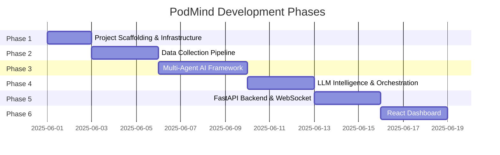
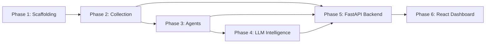

# PodMind — Phased Implementation Plan

> Comprehensive development blueprint for AI-Driven Real-Time Pod Resource Discovery & Dependency Mapping System

---

## Overview

This plan breaks PodMind into **6 development phases**, each self-contained and testable. Phases are ordered by dependency — each phase builds on the outputs of the previous one.



---

## Phase 1 — Project Scaffolding & Infrastructure Setup

### Goal
Set up the complete project skeleton, Kubernetes cluster, Prometheus stack, Redis, and demo workloads. Everything needed before writing application code.

### Deliverables

| # | Task | Files / Commands |
|---|------|-----------------|
| 1.1 | Create project directory structure | All directories per SRS §6 |
| 1.2 | Create `requirements.txt` with all Python dependencies | `requirements.txt` |
| 1.3 | Create `docker-compose.yml` for local dev (Redis + API) | `docker-compose.yml` |
| 1.4 | Create Minikube setup script | `cluster/setup.sh` |
| 1.5 | Create Prometheus Helm values | `cluster/prometheus/values.yaml` |
| 1.6 | Create custom Prometheus recording rules | `cluster/prometheus/custom-rules.yaml` |
| 1.7 | Create Redis deployment manifest (with TimeSeries module) | `cluster/podmind/redis-deploy.yaml` |
| 1.8 | Create demo stress workloads | `cluster/demo-workloads/*.yaml` |
| 1.9 | Create PodMind Kubernetes deployments | `cluster/podmind/collector-deploy.yaml`, `api-deploy.yaml` |
| 1.10 | Create `Makefile` with setup/demo/test targets | `Makefile` |
| 1.11 | Create `.env.example` with all config variables | `.env.example` |
| 1.12 | Create `README.md` with quick start | `README.md` |

### Demo Workloads Detail

| Workload | File | What It Does |
|----------|------|-------------|
| CPU Stress | `cpu-stress.yaml` | Deploys `stress-ng` with configurable CPU load |
| Memory Leak | `memory-leak.yaml` | Python script that allocates 10MB/min indefinitely |
| PVC Writer | `pvc-writer.yaml` | Sequential large file writer to shared PVC |
| Network Flood | `network-flood.yaml` | UDP packet generator targeting configurable endpoint |

### Verification
- [ ] `minikube start --cpus=4 --memory=8192` succeeds
- [ ] `helm install prometheus` succeeds; Prometheus UI accessible
- [ ] Redis pod running; `redis-cli TS.CREATE test_key` succeeds
- [ ] All 4 demo workloads deploy and show in `kubectl get pods`

---

## Phase 2 — Data Collection Pipeline

### Goal
Build the Python async collector service that pulls metrics from Prometheus, kubelet, and Kubernetes API, normalizes them, and writes to Redis TimeSeries.

### Deliverables

| # | Task | File | Description |
|---|------|------|-------------|
| 2.1 | Kubernetes API client | `collector/k8s_client.py` | Pod/PVC/event discovery; async wrapper around kubernetes-python SDK |
| 2.2 | Prometheus query client | `collector/prometheus_client.py` | PromQL executor; returns pandas DataFrames |
| 2.3 | Kubelet stats client | `collector/kubelet_client.py` | `/stats/summary` API for PVC IOPS and throughput |
| 2.4 | Log collector | `collector/log_collector.py` | Async pod log streaming; last 100 lines per pod |
| 2.5 | Metric normalizer | `collector/normalizer.py` | CPU→%, Memory→ratio, PVC→per-GB, 5s resample with forward-fill |
| 2.6 | Redis writer | `collector/redis_writer.py` | TS.CREATE/TS.ADD with retention, labels, and stream publishing |
| 2.7 | Collector main entry | `collector/main.py` | APScheduler job setup; 5s/10s/30s/60s collection cadences |
| 2.8 | Shared config | `collector/config.py` | Environment-based configuration (Redis URL, Prometheus URL, intervals) |

### Architecture Detail

```
┌─────────────────────────────────────────────────────────────┐
│                    collector/main.py                         │
│  APScheduler manages 4 job intervals:                       │
│  ┌──────────┐ ┌──────────┐ ┌──────────┐ ┌──────────┐       │
│  │ 5s: CPU  │ │ 5s: Mem  │ │ 10s: PVC │ │ 10s: Net │       │
│  │  + Mem   │ │          │ │  + Net   │ │          │       │
│  └────┬─────┘ └────┬─────┘ └────┬─────┘ └────┬─────┘       │
│       │             │            │             │             │
│       v             v            v             v             │
│  ┌─────────────────────────────────────────────────┐        │
│  │            normalizer.py                         │        │
│  │  CPU→% of limit | Mem→RSS/limit | PVC→per-GB   │        │
│  │  Resample to 5s uniform | Forward-fill gaps      │        │
│  └────────────────────┬────────────────────────────┘        │
│                       v                                      │
│  ┌─────────────────────────────────────────────────┐        │
│  │            redis_writer.py                       │        │
│  │  TS.CREATE with RETENTION 86400000               │        │
│  │  TS.ADD with auto-timestamp                      │        │
│  │  XADD to Redis Stream for agent consumption      │        │
│  └─────────────────────────────────────────────────┘        │
└─────────────────────────────────────────────────────────────┘
```

### Redis Key Schema

| Pattern | Example | TTL |
|---------|---------|-----|
| `cpu:{namespace}:{pod}` | `cpu:default:nginx-pod` | 24h |
| `mem:{namespace}:{pod}` | `mem:prod:payments-svc` | 24h |
| `pvc:{namespace}:{pvc}` | `pvc:default:data-vol` | 24h |
| `net:{namespace}:{pod}` | `net:default:api-gw` | 24h |
| `event:{namespace}:{pod}:{ts}` | `event:default:db:1717891200` | 24h |
| `meta:{namespace}:{pod}` | `meta:default:nginx` | No TTL (overwritten) |

### Verification
- [ ] Collector starts and connects to Prometheus, Redis, K8s API
- [ ] CPU/memory metrics appear in Redis: `TS.RANGE cpu:default:stress-pod - +`
- [ ] PVC metrics appear: `TS.RANGE pvc:default:data-vol - +`
- [ ] Normalized values are in correct ranges (0.0–1.0 for percentages)
- [ ] 5-second resolution confirmed across 1-minute window

---

## Phase 3 — Multi-Agent AI Framework

### Goal
Build the four specialized agents (CPU, Memory, Storage, Network/Log), the dependency mapper (Granger causality), and the orchestrator that runs them in parallel.

### Deliverables

| # | Task | File | Description |
|---|------|------|-------------|
| 3.1 | Pydantic output schemas | `agents/schemas.py` | All agent input/output models with validation |
| 3.2 | CPU Agent | `agents/cpu_agent.py` | Isolation Forest + Z-score + throttle + gradient |
| 3.3 | Memory Agent | `agents/memory_agent.py` | Linear regression leak + OOM risk + cache pressure |
| 3.4 | Storage Agent | `agents/storage_agent.py` | PVC saturation + restart correlation + write detection |
| 3.5 | Network/Log Agent | `agents/network_agent.py` | Network saturation + chatty pods + log error rate |
| 3.6 | Dependency Mapper | `agents/dependency_mapper.py` | Granger causality + NetworkX graph |
| 3.7 | Forecaster | `agents/forecaster.py` | Prophet/ARIMA per-pod 60-min forecast |
| 3.8 | Orchestrator | `agents/orchestrator.py` | LangGraph DAG; parallel agent execution |
| 3.9 | Unit tests + fixtures | `tests/test_cpu_agent.py`, `tests/fixtures/` | Pre-recorded metric snapshots |

### Agent Output Schemas

```python
# CPU Agent Output
class CPUAgentOutput(BaseModel):
    anomalous_pods: List[AnomalyRecord]       # Isolation Forest flagged
    throttled_pods: List[ThrottleRecord]       # >15% throttle ratio
    trending_pods: List[TrendRecord]           # Accelerating toward limits
    top_consumers: List[ConsumerRecord]        # Highest p99 CPU
    window_start: int
    window_end: int

# Memory Agent Output
class MemoryAgentOutput(BaseModel):
    leak_suspects: List[LeakRecord]            # Positive slope >0.5%/min
    oom_risk_pods: List[OOMRiskRecord]         # Utilization >85%
    cache_pressure_pods: List[CachePressureRecord]
    restart_correlations: List[RestartCorrelation]

# Storage Agent Output
class StorageAgentOutput(BaseModel):
    saturated_pvcs: List[PVCSaturationRecord]
    restart_causal_hypotheses: List[CausalHypothesis]
    bulk_writers: List[BulkWriteRecord]

# Network Agent Output
class NetworkAgentOutput(BaseModel):
    saturated_pods: List[NetworkSaturationRecord]
    chatty_pods: List[ChattyPodRecord]
    error_rate_spikes: List[ErrorRateRecord]
    connection_exhaustion: List[ConnectionExhaustionRecord]
```

### Granger Causality Algorithm

```python
def test_granger_pair(series_a, series_b, max_lag=6):
    """Test if series_a Granger-causes series_b."""
    data = np.column_stack([series_b, series_a])  # [target, cause]
    results = grangercausalitytests(data, maxlag=max_lag, verbose=False)
    min_p = min(results[lag][0]['ssr_ftest'][1] for lag in range(1, max_lag+1))
    best_lag = min(results, key=lambda l: results[l][0]['ssr_ftest'][1])
    return {
        'significant': min_p < 0.05,
        'p_value': min_p,
        'lag_seconds': best_lag * 5,
        'best_lag': best_lag
    }
```

### Verification
- [ ] Each agent produces valid Pydantic output from fixture data
- [ ] Isolation Forest correctly flags the stress-pod as anomalous
- [ ] Memory agent detects the memory-leak pod's upward trend
- [ ] Dependency mapper produces at least 1 edge from demo workloads
- [ ] Full orchestrator cycle completes in < 15 seconds
- [ ] Unit tests pass: `pytest tests/`

---

## Phase 4 — LLM Intelligence & Orchestration

### Goal
Build the tiered LLM client, prompt templates, recommendation engine, and insight persistence.

### Deliverables

| # | Task | File | Description |
|---|------|------|-------------|
| 4.1 | Tiered LLM client | `intelligence/llm_client.py` | Claude → GPT-4o → Ollama fallback chain |
| 4.2 | Prompt templates | `intelligence/prompt_templates.py` | Jinja2 structured prompts with agent output slots |
| 4.3 | Recommendation engine | `intelligence/recommendation_engine.py` | Post-LLM ranking, deduplication, priority assignment |
| 4.4 | Insight store | `intelligence/insight_store.py` | Redis persistence of insight history with TTL |
| 4.5 | LLM output validation | `intelligence/validators.py` | Pydantic schema validation of LLM JSON output |
| 4.6 | Fallback rule engine | `intelligence/rule_engine.py` | Rule-based recommendations when LLM unavailable |

### LLM Tiering Logic

```python
class LLMClient:
    async def generate(self, prompt: str) -> InsightOutput:
        for tier in self.tiers:
            try:
                response = await tier.call(prompt)
                validated = InsightOutput.model_validate_json(response)
                return validated
            except (APIError, ValidationError, Timeout):
                logger.warning(f"Tier {tier.name} failed, falling back...")
                continue
        # All tiers failed → rule-based fallback
        return self.rule_engine.generate(prompt.context)
```

### Prompt Template Structure

```
SYSTEM: You are a Kubernetes SRE expert analyzing a single-node cluster.
  Produce JSON matching the InsightOutput schema.
  Be specific: name pods, namespaces, and metrics. No vague statements.

USER: Cluster state snapshot ({{ window_seconds }}s window):
  CPU anomalies: {{ cpu_output | tojson }}
  Memory anomalies: {{ mem_output | tojson }}
  Storage anomalies: {{ storage_output | tojson }}
  Network anomalies: {{ network_output | tojson }}
  Causal graph edges: {{ graph_summary | tojson }}

  Tasks:
  1. Identify root causes ranked by severity
  2. Provide concrete remediation actions
  3. Flag any pods approaching resource limits
  4. Explain causal chains in the dependency graph
```

### Verification
- [ ] LLM client returns valid `InsightOutput` from all three tiers
- [ ] Fallback chain works: mock API failure → next tier activates
- [ ] Rule engine produces reasonable output when all LLMs fail
- [ ] Insight history persists in Redis and is queryable
- [ ] Prompt template renders correctly with real agent outputs

---

## Phase 5 — FastAPI Backend & WebSocket Server

### Goal
Build the REST API, WebSocket push server, and scheduler that ties collection, agents, and intelligence together.

### Deliverables

| # | Task | File | Description |
|---|------|------|-------------|
| 5.1 | App factory & router registration | `api/main.py` | FastAPI app with CORS, lifespan, scheduler |
| 5.2 | Pydantic response models | `api/models.py` | All API response schemas |
| 5.3 | Pods router | `api/routers/pods.py` | `GET /api/pods`, `GET /api/pods/{ns}/{name}/metrics` |
| 5.4 | Graph router | `api/routers/graph.py` | `GET /api/graph` → D3.js-compatible JSON |
| 5.5 | Insights router | `api/routers/insights.py` | `GET /api/insights/latest`, `GET /api/anomalies` |
| 5.6 | Forecast router | `api/routers/forecast.py` | `GET /api/forecast/{pod}` |
| 5.7 | NLP query router | `api/routers/query.py` | `POST /api/query` → LLM answer |
| 5.8 | PVC router | `api/routers/pvcs.py` | `GET /api/pvcs` |
| 5.9 | Health endpoint | `api/routers/health.py` | `GET /health` → component status |
| 5.10 | WebSocket manager | `api/websocket.py` | Connection manager; 5s push cadence |
| 5.11 | Background scheduler | `api/scheduler.py` | APScheduler: collect (5s), analyze (30s) |
| 5.12 | Integration tests | `tests/test_api_endpoints.py` | All endpoint tests with mocked Redis |

### WebSocket Message Types

```json
// Metrics update (every 5s)
{"type": "metrics", "data": {"pods": [{"name": "...", "cpu": 0.34, "memory": 0.67, ...}]}}

// Insight update (every 30s)
{"type": "insights", "data": {"root_causes": [...], "recommendations": [...]}}

// Graph update (every 30s)
{"type": "graph", "data": {"nodes": [...], "edges": [...]}}

// Anomaly alert (on detection)
{"type": "anomaly", "data": {"pod": "...", "severity": "critical", "message": "..."}}
```

### Verification
- [ ] All REST endpoints return correct status codes and schemas
- [ ] Swagger UI accessible at `/docs` with all endpoints documented
- [ ] WebSocket connects and receives metrics every 5 seconds
- [ ] NLP query endpoint returns structured LLM response
- [ ] Health endpoint reports status of Redis, Prometheus, K8s API
- [ ] Integration tests pass: `pytest tests/test_api_endpoints.py`

---

## Phase 6 — React Dashboard

### Goal
Build the real-time dashboard with live charts, D3.js dependency graph, anomaly timeline, correlation heatmap, forecast panel, and NLP chat interface.

### Deliverables

| # | Task | File(s) | Description |
|---|------|---------|-------------|
| 6.1 | Vite + React project setup | `dashboard/` scaffolding | Vite 5, React 18, Tailwind, shadcn/ui |
| 6.2 | Zustand stores | `store/podStore.js`, `graphStore.js`, `insightStore.js` | WebSocket-driven state management |
| 6.3 | WebSocket hook | `hooks/useWebSocket.js` | Auto-connect, reconnect, message dispatch |
| 6.4 | NLP query hook | `hooks/useNLPQuery.js` | POST to `/api/query`, manages chat history |
| 6.5 | Sidebar | `components/Sidebar.jsx` | Namespace filter, pod search, settings |
| 6.6 | StatusBar | `components/StatusBar.jsx` | Cluster health, anomaly count, connection status |
| 6.7 | PodGrid | `components/PodGrid.jsx` | Card grid with sparklines, status badges |
| 6.8 | DependencyGraph | `components/DependencyGraph.jsx` | D3.js force-directed, colored edges, click-to-analyze |
| 6.9 | AnomalyTimeline | `components/AnomalyTimeline.jsx` | Chart.js swimlane, severity-colored markers |
| 6.10 | CorrelationHeatmap | `components/CorrelationHeatmap.jsx` | Pod × Pod Pearson r matrix, color-coded |
| 6.11 | ForecastPanel | `components/ForecastPanel.jsx` | Prophet chart with horizon slider |
| 6.12 | InsightChat | `components/InsightChat.jsx` | Chat-style NLP interface |
| 6.13 | App layout + routing | `App.jsx`, `main.jsx` | Tab-based layout, responsive design |

### Component Interaction Flow

```
WebSocket ──onmessage──► useWebSocket hook
                              │
              ┌───────────────┼───────────────┐
              v               v               v
         podStore        graphStore      insightStore
              │               │               │
    ┌─────────┼────┐    ┌────┘         ┌─────┘
    v         v    v    v              v
 PodGrid  StatusBar  DependencyGraph  InsightChat
              │              │              │
              └──────────────┼──────────────┘
                             v
                      AnomalyTimeline
                      CorrelationHeatmap
                      ForecastPanel
```

### D3.js Dependency Graph Specification

| Property | Encoding |
|----------|----------|
| Node size | Total resource pressure (composite score) |
| Node color | Health status (green/amber/red) |
| Edge color | Resource type (CPU=blue, Memory=amber, Storage=green, Network=purple) |
| Edge thickness | Causal strength (R² value) |
| Edge direction | Arrow showing cause → effect |
| Node click | Triggers NLP analysis query for that pod |

### Design System

| Element | Specification |
|---------|--------------|
| Font | Inter (Google Fonts) |
| Color scheme | Dark mode primary; glassmorphism panels |
| Primary | `hsl(217, 91%, 60%)` (vivid blue) |
| Accent | `hsl(142, 71%, 45%)` (emerald green) |
| Critical | `hsl(0, 84%, 60%)` (red) |
| Warning | `hsl(38, 92%, 50%)` (amber) |
| Surface | `hsl(222, 47%, 11%)` (dark navy) |
| Animations | Framer Motion for panel transitions; CSS transitions for hover states |

### Verification
- [ ] Dashboard loads and connects to WebSocket
- [ ] PodGrid shows live pod cards with updating sparklines
- [ ] DependencyGraph renders force-directed layout with correct edge colors
- [ ] AnomalyTimeline shows swimlane markers for detected anomalies
- [ ] CorrelationHeatmap renders pod × pod matrix
- [ ] ForecastPanel displays Prophet predictions with adjustable horizon
- [ ] InsightChat sends queries and displays LLM responses
- [ ] Responsive layout works on 1080p and 1440p screens
- [ ] End-to-end demo scenario (§11 of SRS) executes successfully

---

## Cross-Phase Dependencies



---

## Environment Variables

| Variable | Default | Description |
|----------|---------|-------------|
| `PODMIND_LLM_TIER` | `1` | LLM tier: 1=Claude, 2=GPT-4o, 3=Ollama |
| `ANTHROPIC_API_KEY` | — | Anthropic API key (Tier 1) |
| `OPENAI_API_KEY` | — | OpenAI API key (Tier 2) |
| `OLLAMA_HOST` | `http://localhost:11434` | Ollama server URL (Tier 3) |
| `REDIS_URL` | `redis://localhost:6379` | Redis connection string |
| `PROMETHEUS_URL` | `http://localhost:9090` | Prometheus server URL |
| `K8S_IN_CLUSTER` | `false` | Use in-cluster K8s config |
| `COLLECTION_INTERVAL` | `5` | Base collection interval (seconds) |
| `ANALYSIS_INTERVAL` | `30` | Agent analysis cycle (seconds) |
| `WS_PUSH_INTERVAL` | `5` | WebSocket push cadence (seconds) |
| `METRIC_RETENTION_HOURS` | `24` | Redis TimeSeries retention |

---

## Quick Reference: Key Commands

```bash
# Setup
make setup              # Full cluster + dependencies setup
make demo               # One-command demo (start everything + deploy workloads)

# Development
make collect            # Start collector only
make agents             # Run single agent analysis cycle
make api                # Start FastAPI server
make dashboard          # Start React dev server

# Testing
make test               # Run all tests
pytest tests/test_cpu_agent.py -v    # Single test file
pytest tests/ -k "granger"          # Keyword filter

# Monitoring
make logs               # Tail all PodMind pod logs
make redis-cli          # Open Redis CLI with TimeSeries commands
```

---

> [!IMPORTANT]
> **Development Order**: Always complete Phase N before starting Phase N+1. Each phase's verification checklist must pass before proceeding.

> [!TIP]
> **For hackathon demo**: Phases 1-3 are the minimum viable product. Phases 4-6 add the "wow factor" with LLM intelligence and the visual dashboard.
